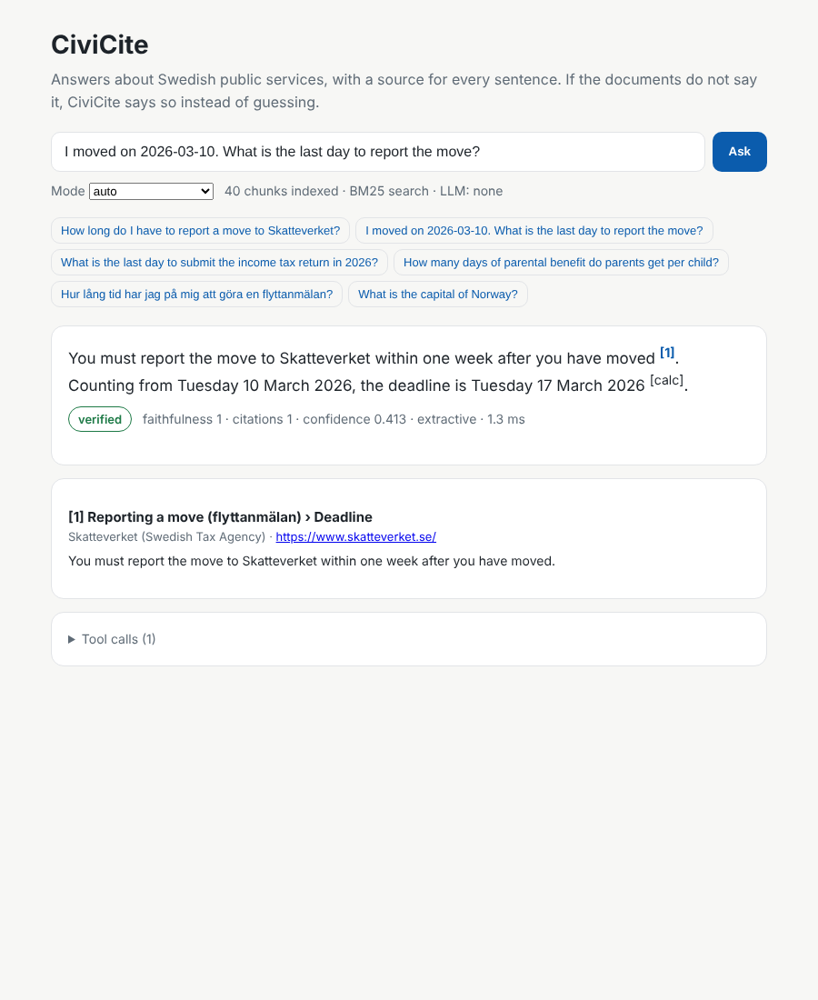

# CiviCite

**A verified, citation-first AI assistant for Swedish public services** (Skatteverket, Försäkringskassan, CSN,
Arbetsförmedlingen, ...). Every sentence in an answer cites a source; a verifier checks each sentence against
the cited text. Deadlines are computed by a deterministic tool that knows the Swedish calendar instead of
by the language model. When the documents do not contain the answer, CiviCite says so.



```text
$ civicite ask "I moved on 2026-03-10. What is the last day to report the move?"

You must report the move to Skatteverket within one week after you have moved [1]. Counting from
Tuesday 10 March 2026, the deadline is Tuesday 17 March 2026 [calc].

  [1] Reporting a move (flyttanmälan) > Deadline - Skatteverket (Swedish Tax Agency)

verification: verified (faithfulness 1.0, citation coverage 1.0) | mode: extractive | confidence: 0.413
```

## Live demo

Try it in the browser: **https://varshith2802.github.io/civicite/**

Ask a question (or tap an example) and get a short answer where every sentence links to the text it comes from,
with a check that each sentence matches its source. The page is [`docs/index.html`](docs/index.html): one file,
no server. It runs the same extractive pipeline as this package (BM25 retrieval, answer planning, Swedish-calendar
deadlines, sentence-level verification, PII redaction), ported to JavaScript and tested against the Python output.

To publish it from your own copy of the repository: **Settings > Pages > Deploy from a branch > `main` / `docs`**.

## Why

Swedish bureaucracy is hard to navigate, especially for newcomers and international students, and generic
chatbots confidently invent rules, amounts and deadlines. CiviCite is built around three guarantees:

1. **Grounding**: answers use only retrieved official text, and every factual sentence carries a citation.
2. **Verification**: a sentence-level checker flags sentences whose words or *numbers* are not in the cited
   source. In `--strict` mode an unverifiable answer is replaced by an abstention.
3. **Abstention**: an evidence-strength score (IDF-weighted query coverage, plus dense similarity when
   enabled) decides when to say "I could not find this".

Additional safeguards: personal data (personnummer/samordningsnummer with Luhn validation, e-mail, phone,
IBAN, card numbers) is redacted **before** the question reaches the model or the logs. Retrieved text that
tries to instruct the model (indirect prompt injection) is dropped.

## Quick start (how it runs)

Requirements: Python 3.10+. No API key needed for the default (extractive) mode.

```bash
unzip civicite.zip && cd civicite
python -m venv .venv && source .venv/bin/activate        # Windows: .venv\Scripts\activate
pip install -e ".[dev]"

pytest -q                       # 28 tests, ~1 s
civicite index                  # builds .civicite/index from data/demo (40 chunks)
civicite ask "How many days of parental benefit do parents get per child?"
civicite serve                  # web UI on http://127.0.0.1:8000  (JSON API: POST /api/ask)
civicite eval --sweep           # evaluation suite + abstention-threshold sweep
```

### With an LLM (agent mode with tool calling)

Any OpenAI-compatible endpoint works. Free and local with [Ollama](https://ollama.com):

```bash
ollama pull qwen2.5:7b-instruct          # or llama3.1:8b - models that support tool calling
civicite ask "I stayed home with my sick child on 2026-01-15. What is the latest date to apply?" \
    --mode llm --llm-base-url http://localhost:11434/v1 --llm-model qwen2.5:7b-instruct
civicite eval --mode llm --llm-base-url http://localhost:11434/v1 --llm-model qwen2.5:7b-instruct
```

Hosted model: `export CIVICITE_LLM_BASE_URL=https://api.openai.com/v1 CIVICITE_LLM_MODEL=gpt-4o-mini
OPENAI_API_KEY=...`, then `civicite serve`. In LLM mode the model gets the retrieved sources and three tools:
`search_documents`, `calculate_deadline` and `next_business_day`. If the LLM is unreachable, CiviCite falls
back to extractive mode and says so.

### Better multilingual retrieval (optional)

```bash
pip install -e ".[dense]"       # sentence-transformers
civicite index --dense          # adds intfloat/multilingual-e5-small embeddings, fused with BM25 (RRF)
```

### Use real agency pages

The bundled `data/demo` corpus contains 12 short **demo documents written for testing**. They are not
official guidance (each file says so). To build an index from the agencies' own pages:

```bash
civicite fetch --seed https://www.skatteverket.se/privat --agency "Skatteverket" --out data/skatteverket --max-pages 150
civicite fetch --seed https://www.forsakringskassan.se/privatperson --agency "Försäkringskassan" --out data/fk --max-pages 150
civicite index --docs data --dense
```

The crawler respects `robots.txt`, waits 1 s between requests, stays inside the seed URL prefix and stores
each page as Markdown with its source URL. Check each site's terms of use before crawling.

### Docker

```bash
docker build -t civicite . && docker run -p 8000:8000 civicite
```

## Architecture

```
question ──► PII redaction ──► hybrid retrieval (BM25 + optional e5 embeddings, RRF; sv→en glossary)
                                   │  injection filter, evidence score
                                   ▼
            ┌── extractive mode: question-type-aware sentence selection + rule-based deadline planner
            └── LLM mode: tool-calling loop (search_documents / calculate_deadline / next_business_day)
                                   ▼
            citation verifier (per sentence: term overlap + number consistency + tool results)
                                   ▼
            answer + numbered sources + verification label + JSONL trace (PII-free)
```

| Module | Purpose |
|---|---|
| `ingest/loader.py`, `ingest/fetch.py` | Markdown/HTML/PDF loading, heading-aware chunking, polite crawler |
| `index/search.py` | BM25, optional dense embeddings, RRF fusion, IDF-weighted coverage |
| `agent/core.py` | Agent loop, extractive planner, source registry, tracing |
| `agent/tools.py` | Swedish calendar (Easter computus, Midsummer, All Saints, eves), deadline arithmetic |
| `guard/pii.py`, `guard/injection.py` | Redaction (Luhn-validated identity numbers) and injection filter |
| `verify/citations.py` | Sentence-level citation and number verification |
| `eval/` | 34-question dataset (26 answerable incl. Swedish, 8 unanswerable incl. hard negatives) |
| `api/` | FastAPI server and single-page UI |

## Evaluation

`civicite eval` reports retrieval recall@5 and MRR, answer accuracy (required phrases present), abstention
precision/recall/F1, faithfulness (verified share of claims), citation precision (cited chunk belongs to an
expected document), tool/date accuracy and latency. CI fails if the extractive baseline regresses.

Measured on the demo corpus (extractive mode, BM25 only, 2026-10-05):

| Metric | Value |
|---|---|
| Retrieval recall@5 / MRR | 1.00 / 1.00 |
| Answer accuracy (26 answerable) | 0.846 |
| Abstention precision / recall / F1 | 1.00 / 0.75 / 0.857 |
| Faithfulness / citation precision | 1.00 / 0.886 |
| Deadline (tool) accuracy | 1.00 (3/3) |
| Latency p50 / p95 | 0.8 ms / 1.1 ms |

Honest notes: the dataset was also used to tune the extractive heuristics, so treat these as development-set
numbers. Write a held-out set before claiming generalisation. Remaining failures are typical lexical-matching
limits: a question answered by the wrong sentence of the right document (4 cases), and two in-domain
hard negatives that are answered instead of abstained ("interest rate on CSN loans", "work permit"). LLM mode
and dense retrieval are designed to fix exactly these. Run `civicite eval --mode llm` and compare.
Full results: `eval_results/`.

## Limitations

* The demo corpus is illustrative. Real deployments must ingest official pages and re-index regularly,
  because rules change.
* Lexical verification catches invented numbers and off-topic sentences, but not every paraphrased
  misstatement. An NLI-based verifier is a natural next step.
* Not legal advice. The UI always links to the source so users can check it.

## License

MIT © 2026 Varshith
